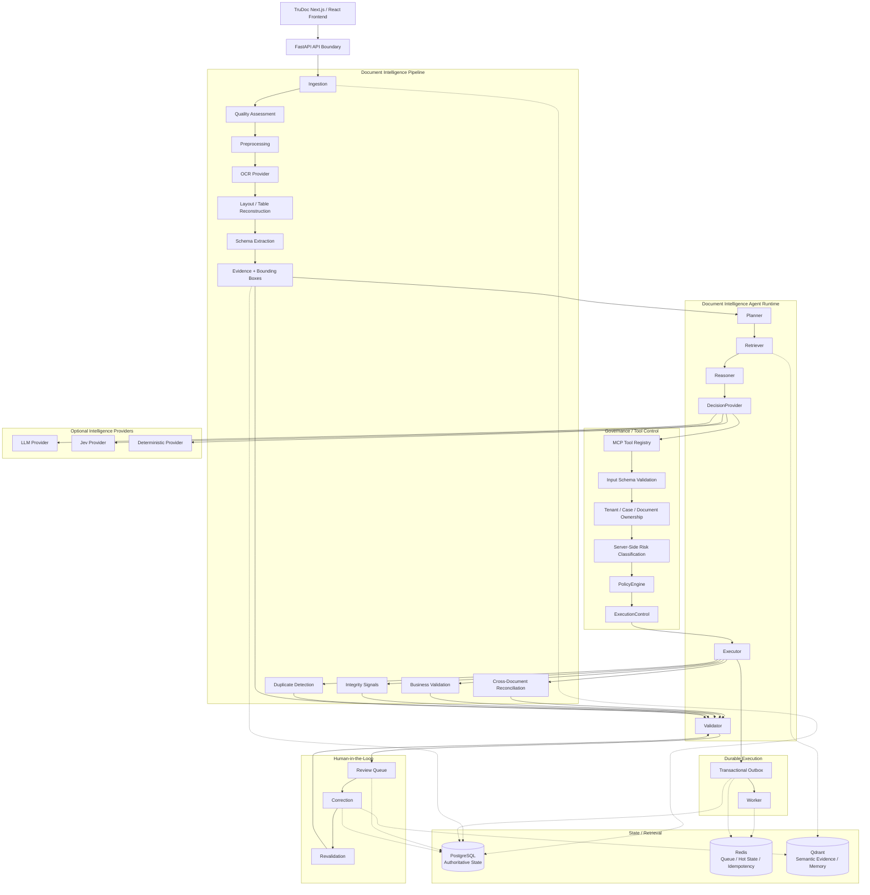
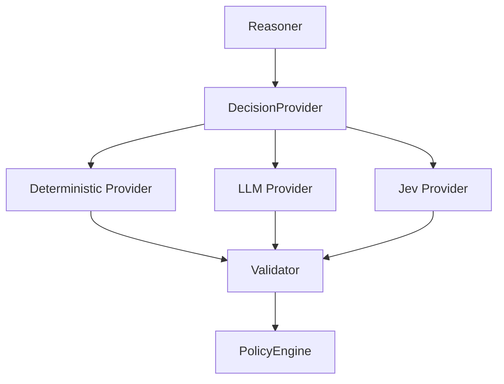
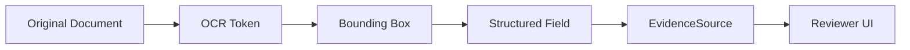
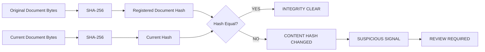
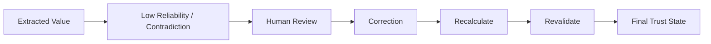
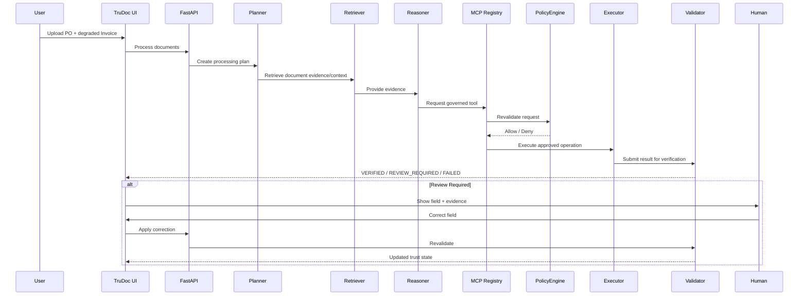
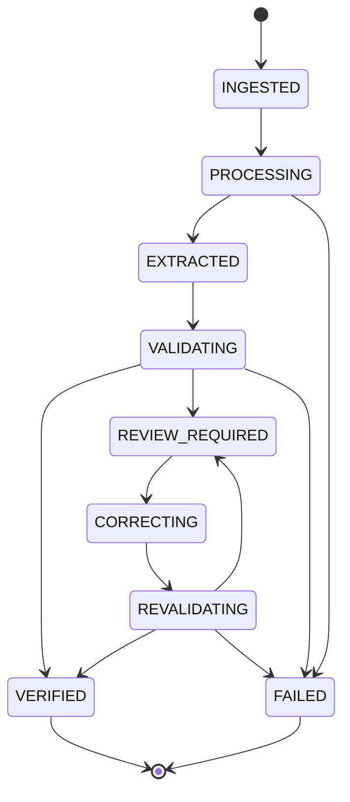

# TruDoc — Trusted Document Intelligence

<p align="center">
  <strong>AI-assisted document extraction with evidence, validation, reconciliation, and human review.</strong>
</p>

<p align="center">


</p>

> **AI extracts. Evidence grounds. Validation checks. Policy constrains. Humans resolve uncertainty. Only verified results become trusted.**

---

## 1. What TruDoc Is

TruDoc is a document-intelligence control plane for messy, real-world documents such as:

- Purchase Orders
- Invoices
- scanned documents
- photographed documents
- rotated / blurred / compressed documents
- partially illegible documents

The core problem is not simply OCR.

The hard problem is:

> **Which extracted value can be trusted without a human looking at it, and which value must be reviewed?**

TruDoc therefore separates:

```text
Extraction
    ≠
Evidence
    ≠
Validation
    ≠
Reconciliation
    ≠
Human Review
    ≠
Verified Truth
```

The system is designed around the principle that a model can propose a value, but it cannot make that value authoritative by itself.

---

## 2. Track 05 Problem Mapping

TruDoc is designed against the Track 05 requirements:

| Requirement | TruDoc capability |
|---|---|
| Two document types | Purchase Order + Invoice |
| Messy / low-quality input | photographed / degraded document path |
| Structured extraction | typed document + field schemas |
| Standard fields | names, identifiers, dates, amounts |
| Complex table | line-item reconstruction |
| Per-field confidence | field-level reliability signal |
| Business validation | subtotal / tax / total consistency |
| Fail loudly | FAILED / REVIEW_REQUIRED instead of confident guessing |
| Tamper signals | heuristic integrity signals |
| Duplicate detection | exact / near-duplicate checks |
| Cross-document checks | PO ↔ Invoice reconciliation |
| Evidence | page + bounding box + source snippet |
| Human review | correction / accept / reject |
| Feedback loop | reviewer correction reuse |
| Evaluation | labelled test data + per-field metrics |

The intended golden path is:

```text
Purchase Order
    ↓
Degraded Invoice
    ↓
OCR + Layout
    ↓
Structured Extraction
    ↓
Field Reliability
    ↓
Evidence
    ↓
Validation
    ↓
Cross-Document Reconciliation
    ↓
Human Review
    ↓
Correction
    ↓
Revalidation
    ↓
Verified / Review Required / Failed
```

---

# 3. Architecture

## 3.1 Enterprise-Shaped Control Plane

The architecture is deliberately **production-shaped** rather than pretending to be a full production deployment during a hackathon.



### Architectural invariant

```text
AI / Reasoner
      ↓
Candidate Proposal
      ↓
Evidence
      ↓
Validation
      ↓
Policy
      ↓
Controlled Execution
      ↓
Independent Verification
      ↓
Final Trust State
```

The system explicitly avoids:

```text
LLM output
    ↓
VERIFIED
```

---

# 4. Enterprise Tool-Control Flow

The tool-control pattern is inspired by mature governed agent-runtime designs, but adapted specifically for document intelligence.

```mermaid
flowchart LR
    TR["Tool Request"]
    REG["MCPToolRegistry"]
    SCH["Input Schema Validation"]
    OWN["Case / Document Ownership"]
    RISK["Risk Classification"]
    POL["PolicyEngine Revalidation"]
    EC["ExecutionControl"]
    OUT["Transactional Outbox"]
    WRK["Durable Worker"]
    TOOL["Document Tool"]
    RES["Validated Tool Result"]

    TR --> REG
    REG --> SCH
    SCH --> OWN
    OWN --> RISK
    RISK --> POL
    POL --> EC
    EC --> OUT
    OUT --> WRK
    WRK --> TOOL
    TOOL --> RES
```



### Example document tools

```text
document.ingest
document.classify
document.assess_quality
document.preprocess
document.ocr
document.extract_fields
document.extract_table
document.get_evidence
document.validate
document.detect_tamper
document.detect_duplicate
document.reconcile
document.create_review
document.apply_correction
document.revalidate
document.retrieve_similar
```

A model does not receive unrestricted Python-function access.

---

# 5. Current Build vs Planned Hardening

TruDoc intentionally distinguishes **what exists now** from **what the architecture supports next**.

## 5.1 Currently Implemented / Working in the Hackathon Build

### Application

- Python 3.12 runtime
- existing `backend/app` modular structure
- Pydantic v2 contracts
- Streamlit development / diagnostic UI
- FastAPI boundary for local integration
- local document processing

### OCR / Document Perception

- EasyOCR integration
- OCR text extraction
- OCR confidence
- OCR bounding boxes
- page-aware evidence representation
- preprocessing / quality assessment path
- raw-image OCR fallback when preprocessing harms OCR

### Document Intelligence

- Purchase Order flow
- Invoice flow
- document classification
- structured field extraction
- line-item/table extraction path
- per-field reliability model
- source evidence model
- validation
- reconciliation
- review state
- correction / revalidation path
- processing trace

### Frontend

- TruDoc Stitch design
- AI Studio-generated frontend
- enterprise dark-mode visual system
- document workspace
- extraction view
- evidence concept
- reconciliation view
- review concept
- agent/control-plane visualization
- Next.js/React integration target

### Reliability / Failure Semantics

The current design explicitly avoids treating a model's raw output as verified truth.

Examples:

```text
UNKNOWN + insufficient evidence
    → REVIEW_REQUIRED / FAILED

Missing evidence
    → REVIEW_REQUIRED

Contradictory documents
    → REVIEW_REQUIRED

Insufficient OCR quality
    → FAILED / REVIEW_REQUIRED
```

---

# 6. Planned Enterprise Hardening

These components are part of the target production-shaped architecture and may be enabled when time / infrastructure allows.

## Redis

Role:

```text
Redis
├── job coordination
├── asynchronous processing state
├── idempotency
├── hot cache
├── retry counters
└── worker coordination
```

Redis is **not** the authoritative source of truth.

## Qdrant

Role:

```text
Qdrant
├── OCR evidence retrieval
├── related document retrieval
├── similar document structures
├── historical reviewed examples
└── correction memory
```

Retrieval must remain scoped by:

```text
tenant_id
case_id
document_id
```

Semantic similarity is supporting evidence; it is never itself a trust decision.

## PostgreSQL

Target authoritative store for:

```text
documents
fields
evidence
tables
validation results
review cases
corrections
reconciliation results
outbox records
audit records
```

## MCP

MCP is used as the governed capability boundary:

```text
Agent
  ↓
MCPToolRegistry
  ↓
Schema validation
  ↓
Ownership
  ↓
Risk
  ↓
Policy
  ↓
ExecutionControl
```

## PolicyEngine

Policy is deterministic.

Examples:

```text
No evidence
    → deny verification

Required field missing
    → review

Cross-document mismatch
    → review

Unknown tool
    → deny

High-risk overwrite
    → deny / human approval
```

## Transactional Outbox + Worker

Target execution semantics:

```text
Authorized operation
       ↓
Transactional Outbox
       ↓
Worker claim
       ↓
Execute
       ↓
Persist result
       ↓
Retry bounded failures
       ↓
Finalize
```

Permanent validation failures should not enter infinite retry loops.

## Jev / LLM DecisionProvider

The decision layer is abstracted:



Jev / LLM may:

- interpret ambiguity
- propose candidate values
- explain possible inconsistencies
- assist decision context

Jev / LLM may not:

- bypass evidence requirements
- bypass validation
- bypass policy
- execute arbitrary tools
- declare a value authoritative merely because the model is confident

---

# 7. Document Trust Model

Every extracted field should be treated as a structured trust object.

Conceptually:

```json
{
  "field_name": "grand_total",
  "value": "42480",
  "raw_text": "₹42,480.00",
  "page": 1,
  "bbox": [x1, y1, x2, y2],
  "ocr_confidence": 0.81,
  "reliability": 0.78,
  "evidence_available": true,
  "validation_status": "PASS",
  "cross_document_status": "MISMATCH",
  "status": "REVIEW_REQUIRED",
  "reasons": [
    "cross_document_mismatch"
  ]
}
```

### Reliability is not a calibrated probability

TruDoc uses the term:

> **reliability score / evidence-backed confidence signal**

not:

> probability that the value is true

Reliability can incorporate:

```text
OCR quality
+
document quality
+
schema validity
+
evidence availability
+
business-rule validation
+
cross-document agreement
+
ambiguity
```

A field should never become `1.00` merely because OCR found a string.

---

# 8. Evidence-First Extraction

The core data lineage is:



For a field such as:

```text
vendor_name
```

a reviewer should be able to see:

```text
Field:
Vendor Name

Normalized value:
ABC Technologies Pvt Ltd

Raw OCR:
ABC Technologees Pvt Lid

Reliability:
0.91

Page:
1

Bounding box:
[x1, y1, x2, y2]

Source:
[document crop]
```

The goal is one-look verification.

---

# 9. Validation Model

Validation is deterministic wherever possible.

## Required examples

```text
subtotal = sum(line totals)

tax = subtotal × tax_rate
        when tax rate is available

grand_total = subtotal + tax
```

Cross-document validation:

```text
PO number
vendor
buyer
quantities
unit prices
subtotal
tax
grand total
```

Possible reconciliation result:

```text
MATCH
MISMATCH
MISSING
AMBIGUOUS
```

The system never silently chooses one source.

---

# 10. Integrity / Tamper Signals

TruDoc treats tamper detection as **signals**, not automatic proof of fraud.
The objective is to make document integrity changes deterministic, visible, and reviewable without pretending that a hash alone establishes malicious intent.

Potential signals:

```text
future date
metadata anomaly
compression anomaly
layout inconsistency
suspicious text inconsistency
duplicate content
unexpected image structure
content hash changed
```

Output semantics:

```text
CLEAR
SUSPICIOUS
UNKNOWN
```

Preferred wording:

```text
SUSPICIOUS — MANUAL REVIEW REQUIRED
```

rather than unsupported claims such as:

```text
FRAUD CONFIRMED
```

## 10.1 Deterministic Content Integrity — SHA-256

A core integrity primitive is a **SHA-256 content hash** of the original document bytes.
This is intentionally simple: the hash provides an exact byte-level identity for a document version and gives TruDoc a deterministic way to detect whether that same registered artifact has changed.

At ingestion:

```text
Original document bytes
        ↓
SHA-256(document_bytes)
        ↓
Store document_hash + hash_algorithm
```

At later verification / reprocessing:

```text
Current document bytes
        ↓
SHA-256(current_bytes)
        ↓
Compare with registered document_hash
```

The resulting state is deterministic:

```text
current_hash == registered_hash
        ↓
INTEGRITY: CLEAR

current_hash != registered_hash
        ↓
CONTENT_CHANGED
        ↓
SUSPICIOUS SIGNAL
        ↓
REVIEW_REQUIRED
```

### Important semantic boundary

A changed SHA-256 hash means that the byte representation of the registered document is no longer identical. It does **not**, by itself, prove malicious tampering or fraud. A legitimate re-export, metadata rewrite, PDF regeneration, or authorized edit can also change the bytes.

Therefore TruDoc uses the signal as:

```text
CONTENT_HASH_CHANGED
```

not:

```text
FRAUD_CONFIRMED
```

### Integrity record

The target integrity metadata is:

```json
{
  "hash_algorithm": "SHA-256",
  "document_hash": "<hex digest>",
  "integrity_status": "CLEAR",
  "verified_at": "<timestamp>"
}
```

When the same registered document changes:

```json
{
  "hash_algorithm": "SHA-256",
  "expected_hash": "<original digest>",
  "current_hash": "<new digest>",
  "integrity_status": "CHANGED",
  "signal": "CONTENT_HASH_CHANGED",
  "review_required": true
}
```

### Integrity flow



This mechanism complements, rather than replaces, higher-level integrity signals such as impossible dates, metadata anomalies, layout inconsistencies, or arithmetic contradictions.

---

# 11. Duplicate Detection

The target design combines deterministic exact matching with optional similarity detection:

```text
SHA-256 exact content hash
+
near-duplicate / perceptual similarity
```

### Exact duplicate

If two uploaded artifacts have the same SHA-256 content hash:

```text
Document A hash
        =
Document B hash
        ↓
EXACT_DUPLICATE
```

This is a deterministic byte-for-byte duplicate signal. It can catch the same file uploaded twice even when filenames differ.

### Near duplicate

For visually similar but byte-different documents, a perceptual fingerprint or equivalent image similarity mechanism can provide a secondary signal:

```text
Document A fingerprint
        ↓
similarity comparison
        ↓
Document B fingerprint
        ↓
DUPLICATE_SUSPECTED
```

A duplicate signal becomes part of the trust/review context. It does not by itself prove fraud or invalidity.

### Why both mechanisms exist

```text
SHA-256
→ exact byte identity

Perceptual similarity
→ semantic / visual similarity
```

The first is deterministic and exact; the second tolerates benign changes such as recompression or image re-encoding.

---

# 12. Human-in-the-Loop

Uncertain fields should enter:

```text
REVIEW_REQUIRED
```

Reviewer actions:

```text
ACCEPT
CORRECT
REJECT
```

Correction lifecycle:



Stored correction context:

```text
document_id
field_name
old_value
new_value
reason
reviewer
timestamp
```

Where implemented, reviewed corrections may be reused on a subsequent run.

This is described as:

> **review feedback reused on subsequent runs**

rather than an unsupported claim of machine-learning improvement.

---

# 13. Agent Execution Trace

The user-facing trace should expose the actual control flow:



---

# 14. Golden Demo

The primary demonstration is:

### Purchase Order

```text
PO-2026-1042
Vendor: ABC Technologies Pvt Ltd
Buyer: XYZ Industries Pvt Ltd
Subtotal: ₹35,000
Tax: ₹6,300
Grand Total: ₹41,300
```

### Invoice

The Invoice intentionally contains a discrepancy.

Example:

```text
Invoice subtotal: ₹36,000
Invoice tax:      ₹6,480
Invoice total:    ₹42,480
```

Reconciliation:

```text
PO Total:       ₹41,300
Invoice Total:  ₹42,480
Difference:      ₹1,180

MISMATCH DETECTED
REVIEW REQUIRED
```

The system must not silently "fix" the invoice.

---

# 15. Synthetic Data & Evaluation

Synthetic data is useful in TruDoc primarily as a **labelled evaluation and robustness layer**.

It does not require training a new model.

Recommended evaluation corpus:

```text
clean PO
clean Invoice
rotated variants
blurred variants
compressed variants
perspective variants
low-contrast variants
partially illegible variants
```

Each sample should have known ground truth.

Example:

```json
{
  "document_type": "PURCHASE_ORDER",
  "po_number": "PO-2026-1042",
  "vendor_name": "ABC Technologies Pvt Ltd",
  "subtotal": 35000,
  "tax": 6300,
  "grand_total": 41300
}
```

Evaluation should report per-field metrics:

```text
precision
recall
exact-match / normalized-match
review rate
false-trust rate
```

One especially important safety metric is:

> **False-trust cases: incorrect / unsupported fields incorrectly marked VERIFIED.**

---

# 16. Technology Stack

## Current / Hackathon Build

### Backend

- Python 3.12
- FastAPI
- Pydantic v2
- existing document pipeline
- local file/document processing
- Streamlit development interface

### OCR / Computer Vision

- EasyOCR
- Tesseract compatibility path
- OpenCV-style preprocessing / document-quality processing
- OCR confidence
- OCR bounding boxes
- page-aware evidence

### Frontend

- Next.js / React target application
- TypeScript
- Tailwind CSS
- Stitch-designed TruDoc UI
- AI Studio generated/refined frontend

## Planned / Enterprise Hardening

- PostgreSQL
- Redis
- Qdrant
- MCP tool governance
- PolicyEngine
- Transactional Outbox
- Durable Worker
- Jev DecisionProvider
- LLM DecisionProvider
- deterministic DecisionProvider
- stronger observability / OpenTelemetry-compatible tracing
- broader evaluation corpus

The distinction between **current** and **planned** is deliberate. Technology appearing in the target architecture does not imply it is currently deployed or operational.

---

# 17. Repository Structure

Current repository is intentionally compact:

```text
velloe/
├── backend/
│   └── app/
│       ├── __init__.py
│       ├── models.py
│       ├── pipeline.py
│       ├── api.py
│       └── ui.py
│
├── frontend/
│   └── ...
│
├── samples/
│   ├── purchase_order.png
│   └── ...
│
├── docs/
│   └── screenshots/
│       ├── 01-overview.png
│       ├── 02-extraction.png
│       ├── 03-evidence.png
│       ├── 04-validation.png
│       ├── 05-reconciliation.png
│       ├── 06-review.png
│       └── 07-agent-trace.png
│
└── README.md
```

Additional modules can be introduced as functionality becomes real; empty architectural shells are intentionally avoided.

---

# 18. Product Proof

Screenshots will be added after the final local run.

## 01 — TruDoc Overview

> Add screenshot: `docs/screenshots/01-overview.png`

## 02 — Structured Extraction

> Add screenshot: `docs/screenshots/02-extraction.png`

## 03 — Evidence / Bounding Box

> Add screenshot: `docs/screenshots/03-evidence.png`

## 04 — Validation

> Add screenshot: `docs/screenshots/04-validation.png`

## 05 — PO ↔ Invoice Reconciliation

> Add screenshot: `docs/screenshots/05-reconciliation.png`

## 06 — Human Review / Correction

> Add screenshot: `docs/screenshots/06-review.png`

## 07 — Agent / MCP Execution Trace

> Add screenshot: `docs/screenshots/07-agent-trace.png`

---

# 19. Local Development

## Backend

From the repository root:

```powershell
cd D:\velloe
py -3.12 -m uvicorn backend.app.api:app --host 127.0.0.1 --port 8000
```

FastAPI documentation:

```text
http://127.0.0.1:8000/docs
```

Health endpoint, when available:

```text
http://127.0.0.1:8000/api/system/health
```

## Streamlit Development UI

```powershell
cd D:\velloe
py -3.12 -m streamlit run backend\app\ui.py
```

## Frontend

From the frontend directory:

```powershell
cd D:\velloe\frontend
npm install
npm run dev
```

The frontend should use:

```text
NEXT_PUBLIC_API_BASE_URL=http://127.0.0.1:8000
```

Normal runtime should keep:

```text
NEXT_PUBLIC_USE_MOCKS=false
```

If mock mode exists, it must be explicit and clearly labelled.

---

# 20. Engineering Principles

## Evidence > Confidence Theater

A number such as `0.91` is not useful unless the system can explain why the field received that signal.

## Validation > Model Output

OCR and reasoning generate candidates.

Validation establishes whether the candidate satisfies deterministic constraints.

## Policy > Agent Proposal

The agent may request a capability.

Policy decides whether the capability is allowed.

## Provider / Source Truth > AI Assumption

When documents disagree, the system surfaces the disagreement instead of silently choosing a winner.

## Human Review > Silent Guessing

When evidence is insufficient, TruDoc should say so.

## Authoritative State > Cache / Memory

Redis and Qdrant are supporting infrastructure.

They do not become the source of truth for final document status.

## Small Coherent Modules > Architecture Theater

The repository should remain understandable and executable.

---

# 21. Trust State Machine



The key rule is:

```text
EXTRACTED
    ≠
VERIFIED
```

---

# 22. Security & Governance Boundaries

The target architecture supports:

```text
Document / Case ownership
        ↓
Tenant isolation
        ↓
Tool schema validation
        ↓
Server-side risk classification
        ↓
Deterministic policy
        ↓
Controlled execution
```

Important controls include:

- no arbitrary tool execution from the model
- input schema validation
- document / case ownership checks
- scoped semantic retrieval
- bounded retries
- explicit human approval
- authoritative persistence
- auditable execution trace

---

# 23. Failure Semantics

Failure is a first-class product state.

Examples:

```text
OCR unavailable
    → degraded extraction / REVIEW_REQUIRED / FAILED

Document type unknown
    → REVIEW_REQUIRED

Required field missing
    → REVIEW_REQUIRED

Evidence missing
    → REVIEW_REQUIRED

Arithmetic contradiction
    → REVIEW_REQUIRED

PO / Invoice mismatch
    → REVIEW_REQUIRED

Infrastructure unavailable
    → DEGRADED / explicit error

Unsupported tool
    → DENIED
```

The system must never convert an infrastructure or evidence failure into an apparently successful result.

---

# 24. What TruDoc Demonstrates

The strongest claim is not:

> "We built another OCR application."

It is:

> **"We built a trust layer around document extraction."**

The system treats document intelligence as a controlled decision workflow:

```text
Document
   ↓
Perception
   ↓
Candidate Extraction
   ↓
Evidence
   ↓
Reasoning
   ↓
Validation
   ↓
Reconciliation
   ↓
Policy / Control
   ↓
Human Review when necessary
   ↓
Verified Outcome
```

That architecture is designed to make the transition from:

```text
unstructured document
```

to:

```text
structured, explainable, reviewable, auditable information
```

without hiding uncertainty.

---

# 25. Known Limitations

This repository is a hackathon implementation.

Do not interpret the target architecture as proof of production deployment.

Current limitations may include:

- local OCR runtime dependencies
- CPU inference on environments without a working CUDA stack
- limited labelled evaluation corpus
- heuristic rather than forensic-grade tamper detection
- limited document types
- local development infrastructure
- enterprise services such as Redis / Qdrant / PostgreSQL may be adapters or planned integrations rather than fully deployed infrastructure
- Jev / external LLM providers may be optional
- no claim of calibrated field probabilities
- no claim of production-scale throughput or availability

These limitations are intentionally visible.

---

# 26. Definition of Done

A strong TruDoc demo is one where a reviewer can:

```text
1. Upload a Purchase Order
2. Upload a degraded Invoice
3. Watch the processing flow
4. Inspect structured fields
5. Inspect line items
6. Click a field
7. See its source evidence
8. See its reliability and reasons
9. Inspect validation
10. Compare PO vs Invoice
11. See a genuine mismatch
12. Enter human review
13. Correct a field
14. Revalidate
15. Inspect the final trust state
16. Inspect the agent / MCP execution trace
```

The result must be reproducible locally.

---

# 27. The TruDoc Contract

```text
AI proposes.
Evidence grounds.
Validation checks.
Policy constrains.
Execution is controlled.
Humans resolve uncertainty.
Only verified results become trusted.
```

<p align="center">
  <strong>TRUDOC</strong><br/>
  Trusted Document Intelligence
</p>
